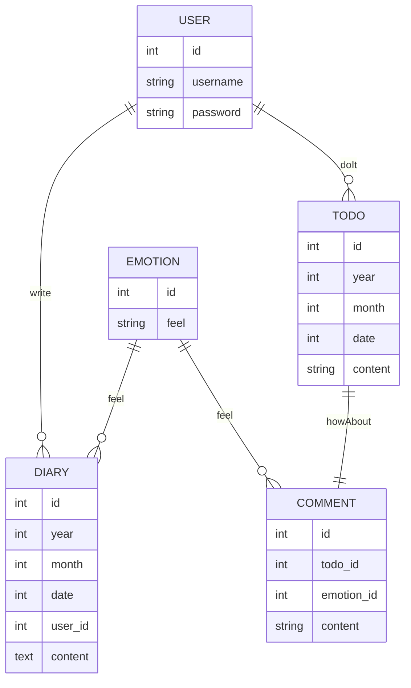

# 그날의 하늘

- [그날의 하늘](#그날의-하늘)
  - [Page](#page)
  - [API](#api)
  - [DB](#db)

## Page

| Path                           | Description                             |
| ------------------------------ | --------------------------------------- |
| /                              | 메인 페이지                             |
| /login                         | 로그인 페이지                           |
| /signup                        | 회원가입 페이지                         |
| /sky                           | /sky/`year`/`month` 리다이렉트          |
| /sky/`year`/`month`            | `year`년 `month`월 일기 페이지          |
| /sky/`year`/`month`/`day`      | `year`년 `month`월 `day`일 일기 페이지  |
| /sky/`year`/`month`/`day`/star | `year`년 `month`월 `day`일 할 일 페이지 |

## API

<table>
  <thead>
    <tr>
      <th>Path</th>
      <th>Method</th>
      <th>Params</th>
      <th>Data</th>
      <th>CRUD</th>
    </tr>
  </thead>
  <tbody>
    <tr>
      <td>/api/sky/<code>year</code>/<code>month</code></td>
      <td>GET</td>
      <td><code>year</code>, <code>month</code></td>
      <td><code>year</code>년 <code>month</code> 월 일기</td>
      <td>READS</td>
    </tr>
    <tr>
      <td rowspan="4">/api/sky/<code>year</code>/<code>month</code>/<code>day</code>/cloud</td>
      <td>GET</td>
      <td rowspan="6"><code>year</code>, <code>month</code>, <code>day</code></td>
      <td rowspan="4"><code>year</code>년 <code>month</code> 월 <code>day</code> 일 일기</td>
      <td>READ</td>
    </tr>
    <tr>
      <td>POST</td>
      <td>CREATE</td>
    </tr>
    <tr>
      <td>PUT</td>
      <td>UPDATE</td>
    </tr>
    <tr>
      <td>DELETE</td>
      <td>DELETE</td>
    </tr>
    <tr>
      <td rowspan="2">/api/sky/<code>year</code>/<code>month</code>/<code>day</code>/star</td>
      <td>GET</td>
      <td rowspan="2"><code>year</code>년 <code>month</code> 월 <code>day</code> 일 할 일</td>
      <td>READS</td>
    </tr>
    <tr>
      <td>POST</td>
      <td>CREATE</td>
    </tr>
    <tr>
      <td rowspan="2">/api/sky/<code>year</code>/<code>month</code>/<code>day</code>/star/<code>star_id</code></td>
      <td>PUT</td>
      <td rowspan="2"><code>year</code>, <code>month</code>, <code>day</code>, <code>star_id</code></td>
      <td rowspan="2"><code>year</code>년 <code>month</code> 월 <code>day</code> 일 할 일 <code>star_id</code></td>
      <td>UPDATE</td>
    </tr>
    <tr>
      <td>DELETE</td>
      <td>DELETE</td>
    </tr>
    <tr>
      <td rowspan="4">/api/sky/<code>year</code>/<code>month</code>/<code>day</code>/star/<code>star_id</code>/cloud</td>
      <td>GET</td>
      <td rowspan="4"><code>year</code>, <code>month</code>, <code>day</code>, <code>star_id</code></td>
      <td rowspan="4"><code>year</code>년 <code>month</code> 월 <code>day</code> 일 할 일 <code>star_id</code> 소감</td>
      <td>READ</td>
    </tr>
    <tr>
      <td>POST</td>
      <td>CREATE</td>
    </tr>
    <tr>
      <td>PUT</td>
      <td>UPDATE</td>
    </tr>
    <tr>
      <td>DELETE</td>
      <td>DELETE</td>
    </tr>
  </tbody>
</table>

## DB

# ThatdaySkyProject
